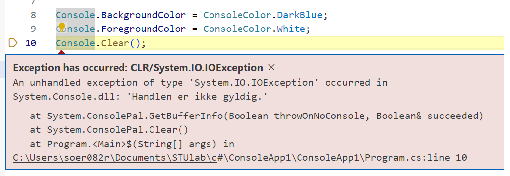
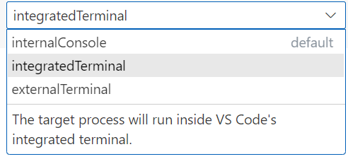
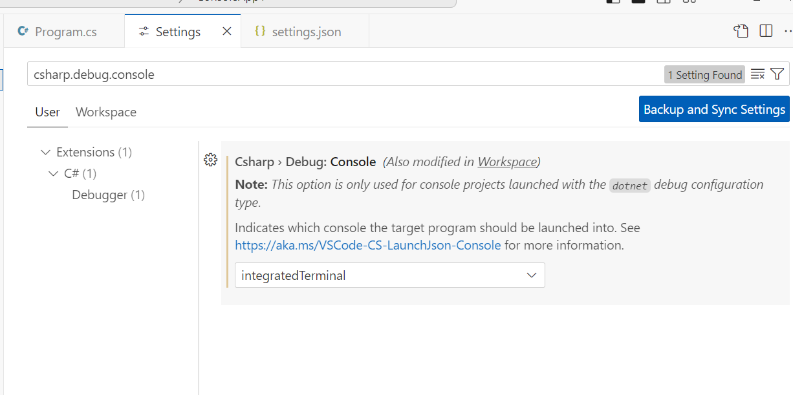
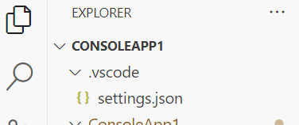
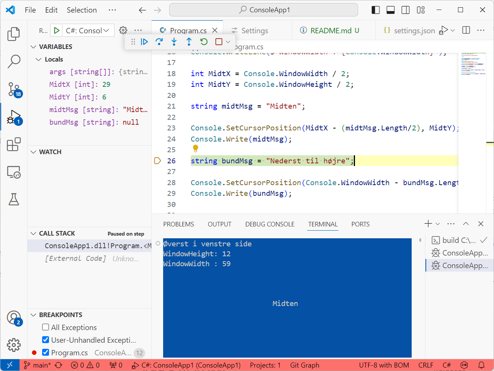

# Consolde og debug i VS Code

C# kan sagtens kodes i vs code. Men der er problemer når man bruger de lidt mere smarte metoder i `Console` objektet, som f.eks. `Console.SetCursorPosition(x,y)` eller `Console.Clear()`, og prøver at køre programmet i _Debuggeren_.

Det sker med _VS Code_'s default `InternalConsole`.

I Menuen __File__, vælg __Preferences__ og __Settings__ .  
I søgefeltet kan du navigere frem til `csharp.debug.console`. Og her vælge _interatedConsole_ i stedet for default _internalConsole_.

På billedet her over har jeg vælgt at gemme instillingen i _User_-space. Det har den fordel at indstillingen vil virke for alle nye c-sharp projekter.  
Man kan også vælge _Workspace_. Så genereres filen `settings.json` i en ny mappe i din _workspace_-mappe: `.vscode`. Jeg har allerede lavet denne fil i dette projekt.

Nu virker debuggeren:

